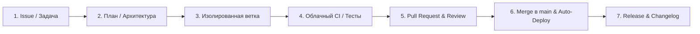

# Инструкции для AI-агентов (Buyerly)

## 🖥 1. Системное окружение
- **ОС**: NixOS (Linux).
- **Пакеты и запуск**: Для запуска компиляторов и утилит использовать `nix-shell` (например `nix-shell -p ...`).
- **🚫 ЗАПРЕТ НА ЛОКАЛЬНЫЕ ТЕСТЫ (КАТЕГОРИЧЕСКИ)**:
  * **НИКОГДА** не запускать `pytest`, `unittest`, `python -m unittest` или тестовые пакеты локально на компьютере пользователя. Это перегревает процессор и забивает ресурсы ноутбука.
  * Все тесты выполняются **исключительно в облаке GitHub Actions**. Проверять результаты тестов разрешено только удаленно через `gh run view --log-failed`.

---

## 🏆 2. Эталонный рабочий процесс (Golden Standard Workflow)

Разработка в проекте ведется по стандартам ведущих продуктовых IT-компаний (Trunk-Based Development + Docs-as-Code + CI/CD Quality Gate):



### 1. Постановка задачи и планирование (Issue & Plan):
- Перед началом работы формулируется цель и критерии готовности (Definition of Done).
- Для сложных задач и архитектурных изменений составляется `implementation_plan.md` до внесения правок в код.

### 2. Строгая изоляция веток (No Branch Stacking):
- Каждая новая задача создаётся **СТРОГО от чистого и обновлённого `main`**:
  ```bash
  git checkout main
  git pull origin main
  git checkout -b <type>/issue-<N>-<short-name>
  ```
- **Категорически запрещено** создавать ветки поверх других незамёрдженных фиче-веток.
- 1 ветка = 1 Issue / 1 конкретная задача. Никаких правок параллельных компонентов.

### 3. Хотфиксы и документация:
- Любые обновления юридических документов, политик, инструкций или мелкие фиксы оформляются **отдельной изолированной веткой** от `main` (например `docs/update-...` или `fix/...`), а не поверх открытых задач.

### 4. Стандарт коммитов (Conventional Commits):
- Использовать понятные префиксы:
  - `feat: ...` — новая функциональность.
  - `fix: ...` — исправление ошибки.
  - `docs: ...` — документация, отчеты, регламенты.
  - `test: ...` — добавление или обновление тестов.
  - `refactor: ...` — рефакторинг кода без изменения поведения.
  - `perf: ...` — оптимизация производительности.
- В описании коммита или PR указывать `Closes #N` / `Fixes #N` при наличии Issue.

### 5. Контроль перед коммитом и PR:
- Перед созданием PR обязательно проверить чистоту диффа:
  ```bash
  git log --oneline main..HEAD
  git diff --stat main..HEAD
  ```
- Убедиться, что ветка содержит **только свои целевые коммиты**.

### 6. Облачный Quality Gate (CI / CD):
- После пуша в origin запускается удаленный пайплайн GitHub Actions.
- Тесты проверяются через `gh run watch` / `gh run view --log-failed`.
- PR переводится в статус `in rev` в ClickUp. Слияние разрешено **ТОЛЬКО** после ревью и явного одобрения пользователем.

### 7. Слияние и деплой:
- После одобрения пользователем PR мёрджится в `main` (через `gh pr merge <N> --merge --delete-branch`).
- Ветка `main` автоматически деплоится на боевой сервер (VPS) через `.github/workflows/deploy.yml`.
- Задача в ClickUp переводится в `complete`.

### 8. Регламент работы с ClickUp (СТРОГО БЕЗ ЭМОДЗИ):
- **КАТЕГОРИЧЕСКИ ЗАПРЕЩЕНО** использовать любые эмодзи в комментариях, названиях и описаниях задач ClickUp. Только чистый текст и ссылки.

### 9. Документация и релизы (Docs-as-Code):
- Значимые изменения и релизы фиксируются в [`CHANGELOG.md`](CHANGELOG.md) по стандарту *Keep a Changelog* и *SemVer*.
- Архитектурные отчеты и результаты аудитов сохраняются в [`docs/`](docs/).
- Релизные вехи фиксируются через теги и GitHub Releases (`gh release create vX.Y.Z`).

---

## 🎨 3. Дизайн и UI/UX референс
- **Референс стиля дизайна**: [`webapp/attio-reference.html`](webapp/attio-reference.html) — эталон стиля для веб-интерфейса платформы (эстетика Attio CRM: высокая плотность данных, минималистичная нейтральная палитра, аккуратные таблицы, бейджи, карточки и типографика).
