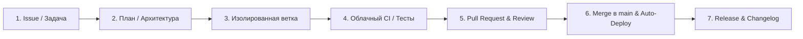

# Инструкции для AI-агентов (Buyerly)

## 🖥 1. Системное окружение
- **ОС**: NixOS (Linux). `dnf`, `rpm` и `apt` отсутствуют.
- **Пакеты и утилиты**: систему **не менять**. Пакеты не устанавливать и `sudo` не использовать: конфигурация NixOS декларативная, императивная установка её ломает. Если инструмента не хватает — разовый запуск через `nix-shell -p <pkg> --run '...'`, а при необходимости постоянного инструмента попросить пользователя добавить его в конфигурацию.
- **Что доступно локально**: `git`, `gh`, `perl`, стандартные утилиты GNU.
- **⚠️ Чего локально НЕТ**: `python`, `python3`, `node`, `npm`, `tsc`, линтеров. Ни тесты, ни typecheck, ни сборку фронта запустить физически нельзя — правки уезжают в CI непроверенными, поэтому вычитывать диff нужно особенно внимательно (см. §2.5).
- **🚫 Бюджет локальных проверок**:
  * **Полный прогон** (`python -m unittest discover tests`) локально не запускать. Тестам нужны Postgres 16 и Redis 7 (см. `services:` в `.github/workflows/deploy.yml`) — это минуты нагрузки на ноутбук пользователя.
  * **Дешёвые проверки разрешены и приветствуются**, если инструмент появится в окружении: `python -m compileall <изменённые файлы>`, линтер, `tsc --noEmit`, `npm run build`, отдельный тест-кейс без БД. Их цена — секунды CPU, и они ловят синтаксис и опечатки до того, как те попадут в репозиторий.
  * Полный результат тестов — только из CI, и запускается он **на открытии PR**, а не на пуше в ветку (см. §2.6).

---

## 🏆 2. Эталонный рабочий процесс (Golden Standard Workflow)

Разработка ведётся по модели GitHub Flow (короткоживущая ветка → PR → зелёный CI → мёрдж в `main` → автодеплой), дополненной Docs-as-Code и CI/CD Quality Gate:



### 1. Постановка задачи и планирование (Issue & Plan):
- Перед началом работы формулируется цель и критерии готовности (Definition of Done).
- Для сложных задач и архитектурных изменений составляется `implementation_plan.md` до внесения правок в код.

### 2. Строгая изоляция веток (No Branch Stacking):
- Каждая новая задача создаётся **СТРОГО от чистого и обновлённого `main`**:
  ```bash
  git checkout main
  git pull origin main
  git checkout -b <type>/issue-<N>-<short-name>   # есть Issue
  git checkout -b <type>/<short-name>             # задача из чата, без Issue
  ```
- **Категорически запрещено** создавать ветки поверх других незамёрдженных фиче-веток.
- 1 ветка = 1 задача. Если Issue есть — ветка и PR ссылаются на него; если задача пришла из чата, номер в имени опускается. Никаких правок параллельных компонентов.
- `<type>` — тот же префикс, что и в коммитах (см. §2.4).

### 3. Хотфиксы и документация:
- Любые обновления юридических документов, политик, инструкций или мелкие фиксы оформляются **отдельной изолированной веткой** от `main` (например `docs/update-...` или `fix/...`), а не поверх открытых задач.

### 4. Стандарт коммитов (Conventional Commits):
- Использовать понятные префиксы:
  - `feat: ...` — новая функциональность.
  - `fix: ...` — исправление ошибки.
  - `docs: ...` — документация, отчеты, регламенты.
  - `test: ...` — добавление или обновление тестов.
  - `refactor: ...` — рефакторинг кода без изменения поведения.
  - `perf: ...` — оптимизация производительности.
  - `chore: ...` — обслуживание репозитория: зависимости, конфигурация, удаление мёртвого кода, сквозные нефункциональные правки.
- В описании коммита или PR указывать `Closes #N` / `Fixes #N` при наличии Issue.

### 5. Контроль перед коммитом и PR:
- Перед созданием PR обязательно проверить чистоту диффа:
  ```bash
  git log --oneline main..HEAD
  git diff --stat main..HEAD
  ```
- Убедиться, что ветка содержит **только свои целевые коммиты**.
- Локально код не исполняется (см. §1), поэтому диff — единственный барьер до CI. Вычитать `git diff main..HEAD` целиком: синтаксис, парность кавычек и скобок, сохранность `f`-префиксов и плейсхолдеров в строках.
- **Массовая правка строк — отдельный риск.** Если менялся текст, который проверяют тесты (сообщения ошибок, подписи метрик, статусы, тексты кнопок бота), найти зависимые ассерты и обновить их в том же коммите: `grep -rn "<фрагмент старой строки>" tests/`.

### Секреты и чувствительные файлы:
- `.env` не коммитить и не выводить в лог; он подключается в `docker-compose.yml` через `env_file`.
- Токены, ключи, пароли и `*_TOKEN` / `*_SECRET` / `*_KEY` не попадают ни в код, ни в коммиты, ни в описания PR.
- Дампы БД, пользовательские загрузки из `uploads/` и логи из `logs/` в репозиторий не добавляются.

### 6. Облачный Quality Gate (CI / CD):
- Пайплайн `.github/workflows/deploy.yml` запускается по трём триггерам: `pull_request`, `push` в `main` и ручной `workflow_dispatch`.
- **Пуш в feature-ветку сам по себе не запускает ничего.** Чтобы получить тесты, нужно открыть PR (`gh pr create`) — только тогда появится прогон, результаты которого можно смотреть.
- Прогон отслеживается через `gh run watch`, разбор падения — через `gh run view --log-failed`.
- Слияние разрешено только при 100% успешном прохождении тестов.

### 7. Слияние и деплой:
- PR мёрджится в `main` (через `gh pr merge <N> --merge --delete-branch`).
- **⚠️ `main` — это прод.** Мёрдж немедленно запускает автодеплой на боевой VPS (job `deploy` в `.github/workflows/deploy.yml`). Мёрджить только после зелёного CI и подтверждения от пользователя; коммитить и пушить напрямую в `main`, равно как и делать туда force-push, запрещено.

### 8. Документация и релизы (Docs-as-Code):
- Значимые изменения и релизы фиксируются в [`CHANGELOG.md`](CHANGELOG.md) по стандарту *Keep a Changelog* и *SemVer*.
- Архитектурные отчеты и результаты аудитов сохраняются в [`docs/`](docs/).
- Релизные вехи фиксируются через теги и GitHub Releases (`gh release create vX.Y.Z`).

---

## 🎨 3. Дизайн и UI/UX референс
- **Обязательный UI-контракт**: перед любым изменением страницы, модального окна, кнопки, поля, таблицы, статуса или responsive-вёрстки агент обязан полностью прочитать [`docs/UI_CONTRACT.md`](docs/UI_CONTRACT.md) и релевантный раздел [`docs/DESIGN_SYSTEM.md`](docs/DESIGN_SYSTEM.md).
- **Production-источник визуальных значений**: [`frontend/src/styles/tokens.css`](frontend/src/styles/tokens.css). Цвета, типографика, spacing, размеры controls, radii, shadows, layers и motion меняются semantic-токеном там, а не копируются в page-specific component.
- **Production-источник shared components**: [`frontend/src/ui/`](frontend/src/ui/). Существующий React primitive переиспользуется; повторяющийся control сначала оформляется как shared primitive, а не как новая локальная семья.
- [`frontend/src/styles/index.css`](frontend/src/styles/index.css) — shared/domain composition layer. Он потребляет semantic tokens, но не создаёт второй источник глобальных constants.
- Старый интерфейс удалён. Production UI находится в `frontend/`, public legal HTML и ресурсы — в `frontend/public/`. Пользовательские изображения хранятся в runtime-каталоге `uploads/`.
- Vite создаёт fingerprinted assets, поэтому ручной cache-version не нужен. При изменении shared UI обновить `tests/test_react_frontend_contract.py`.
- Вёрстка должна держать 390/768/1024/1440px без document-level overflow. Собрать фронт и открыть браузер локально нельзя (§1), поэтому агент отвечает за соблюдение правила в коде и явно сообщает, что визуально не проверял; фактическую проверку выполняет пользователь или сборка в CI.
- Id, handlers, API payloads, workspace isolation и security boundaries не меняются визуальным рефакторингом, если это явно не входит в задачу.
- Захваченные страницы сторонних продуктов и локальные HTML-снимки в репозитории не хранятся.
