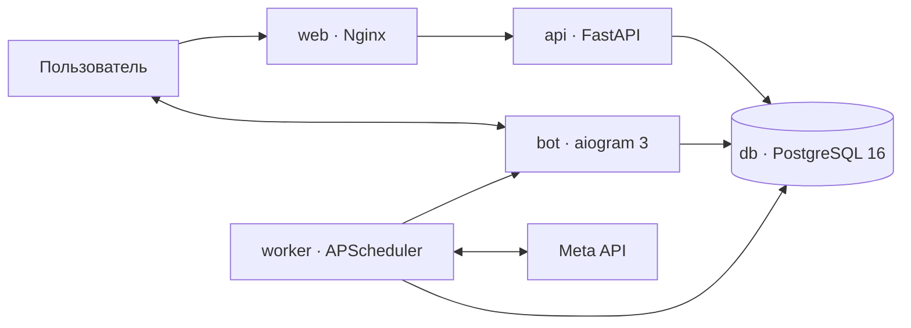

# Buyerly

Buyerly — сервис контроля, мониторинга и автоматизации рекламы Meta Ads для медиабайеров и команд: мульти-воркспейсы, кабинеты, группы, прозрачные сводки с настраиваемыми представлениями, конструктор автоправил, защита воронки, история действий и Telegram-уведомления.

Интерфейс платформы выполнен в Linear-like дизайн-системе: высокая информационная плотность, нейтральная палитра, чистые SVG-иконки, интерактивная сетка данных, глобальный поиск и настраиваемый сайдбар.

## Возможности

### Linear-like интерфейс
- Интерактивная таблица с изменением ширины колонок перетаскиванием мыши и сохранением конфигурации вида (Обзор, Доставка, Трафик, Воронка, Пользовательский).
- Всплывающее меню сортировки (Attio sort popup) с выбором направления и полей на русском языке.
- Сайдбар с регулируемой шириной (200–360 px), сворачиваемыми секциями («Рекламные аккаунты», «Facebook»), счётчиками элементов и обрезкой длинных названий.
- Быстрый глобальный поиск (Cmd+K / Ctrl+K) по кабинетам, группам, правилам и аккаунтам с навигацией с клавиатуры.
- Попап уведомлений и приветственная карточка Buyerly AI на главной странице.
- Пользовательское drag-and-drop переупорядочивание списков и групп кабинетов.
- Плавающая панель массовых действий (Floating bulk action bar) при выборе нескольких кабинетов.

### Мульти-воркспейсы (Workspaces) и Команда
- Изолированные рабочие пространства компаний/команд с гранулярным RBAC (`owner`, `admin`, `buyer`, `viewer`).
- Строгая изоляция ресурсов: кабинеты, правила, группы, сводки и аудит привязаны к `workspace_id`.
- Система приглашений (Team Invites): персональные инвайты по email и публичные ссылки с токенами (`/invite/<token>`).
- Управление командой: назначение ролей, исключение, добровольный выход (`leave`) и передача владения (`transfer-ownership`).
- Семантическая маршрутизация без `/w/`: `/<workspace>/inbox`, `/<workspace>/ads/campaigns`, `/<workspace>/rules`, `/<workspace>/statistics`, `/<workspace>/settings`.
- Создание первого воркспейса на `/create-workspace` с проверкой занятого URL без автоматических числовых суффиксов.
- Выпадающий Workspace Switcher в сайдбаре с бейджами, ролями и переключением в 1 клик.

### Аутентификация, Онбординг и Почта (Resend)
- Закрытый web-вход по whitelist или приглашению: одно письмо содержит одноразовую ссылку и шестизначный код, а публичной регистрации нет.
- После входа owner создаёт workspace, указывает Name и при желании приглашает команду; приглашённый участник пропускает создание workspace. Поля Title нет.
- Интеграция с официальным REST API Resend для транзакционной отправки кодов верификации и приглашений в команду с адаптивными HTML-шаблонами.
- Защита от брутфорса OTP (максимум 5 попыток) и sliding-window rate limiting.
- Ограниченные серверные web-сессии с `HttpOnly` cookie, ротацией, CSRF-защитой и отзывом отдельных устройств.

### Управление кабинетами и подключение
- Массовое добавление кабинетов из текстового экспорта Meta Business Manager.
- Архитектурная поддержка официального Facebook Login for Business (OAuth 2.0) и ручного подключения через System User Token (в настоящий момент процесс проходит официальную верификацию Meta Business Manager для домена buyerly.app).
- Сквозное симметричное шифрование токенов (Fernet) с поддержкой ротации ключей; токены никогда не передаются на клиент и маскируются в логах.
- Собственные названия, рабочие заметки и сохраненная активность в карточках кабинетов без перезаписи данных в Meta.
- Пользовательские группы кабинетов (many-to-many) с мгновенным срезом сводки без дополнительных запросов к Meta API.
- Раздельные статусы кабинета в Meta (Active, Disabled, Unsettled), состояния мониторинга и исполнения правил.

### Движок автоправил и защита воронки
- Гибкий конструктор правил с логикой `AND` / `OR`, временными окнами (today, yesterday, last_3d, last_7d), интервалами проверки и cooldown.
- Действия: остановка (turn_off), включение (turn_on), уведомление (notify_only), масштабирование бюджета с процентом и дневным лимитом (increase_budget), снижение бюджета (decrease_budget).
- Защита воронки: наличие регистраций или покупок подавляет выключение; нулевая воронка требует подтверждения в настраиваемом окне (STOP_CONFIRMING, 0–60 мин) до фактического действия в Meta.
- Безопасная математика при нулевых событиях, живая проверка противоречий в конструкторе и строгая fail-closed валидация.
- Библиотека шаблонов: 6 редактируемых правил и 2 готовые группы с атомарным назначением на кабинеты.
- Неизменяемый журнал аудита с correlation ID, состоянием до/после и безопасная отмена последнего действия (STOP/START/бюджет) в 1 клик в течение 24 часов.

### Аналитика, сводки и финансы
- Мгновенное открытие сводок из сохраненных снимков в PostgreSQL (SummarySnapshot) и on-demand обновление с защитным семафором частоты запросов.
- Метрики: Spend, Impressions, Reach, Frequency, CPM, Clicks (All, Inline Link, Unique, Outbound), CTR, CPC, Landing Page Views, Leads, Registrations, Purchases, CPL, CPReg, CPP.
- Раздельные денежные итоги по валютам без смешивания USD, EUR и других валют.
- Уведомление о наступлении локальной полночи (00:00) каждого кабинета по его часовому поясу из Meta (ACCOUNT_DAY_STARTED).

### Производительность и безопасность
- Активный worker heartbeat и docker liveness probe для контроля работоспособности фоновых процессов.
- Пакетная загрузка расписаний и подключений без N+1 запросов к базе данных.
- Безопасная фильтрация архивных и удаленных adset без риска потери спенда.
- Адаптивный троттлинг запросов к Meta API на основе заголовков квот (X-App-Usage, X-Business-Use-Case-Usage).
- Безопасное хэширование паролей (bcrypt с авто-рехэшингом), изоляция данных по владельцам и валидация Telegram Mini App initData.

## Архитектура



В production запускаются независимые сервисы `web`, `api`, `bot`, `worker`, `db` и `redis`. Redis обеспечивает единый атомарный rate limit для всех экземпляров API; фоновые задачи и Telegram polling изолированы от веб-интерфейса.

## Быстрый старт

Требуются Docker с Docker Compose, Telegram Bot Token и параметры базы данных PostgreSQL. Redis поднимается автоматически внутри Compose и наружу не публикуется.

```bash
cp .env.example .env
# Заполните BOT_TOKEN, POSTGRES_PASSWORD, WEBAPP_URL, RESEND_API_KEY, EMAIL_FROM и OTP_PEPPER.
# Для Facebook OAuth также заполните все META_* значения из примера.
docker compose up -d --build
curl -fsS http://127.0.0.1:8080/health/ready
```

### Локальная разработка

Для запуска компонентов вне контейнеров используется PostgreSQL:

```bash
# Подготовка окружения
python3 -m venv .venv
source .venv/bin/activate
pip install -r requirements.txt

# Настройка переменных окружения
cp .env.example .env
# Для запуска вне Compose укажите localhost в DATABASE_URL/REDIS_URL.
# На локальном HTTP задайте SESSION_COOKIE_SECURE=false; ENABLE_DEV_AUTH включайте только осознанно.

# Запуск API
uvicorn services.api:app --host 0.0.0.0 --port 8000 --reload
```

## Тестирование

Полный набор тестов покрывает движок правил, API и права доступа, воркспейсы, парсер кабинетов, идемпотентность worker, часовые пояса, аудит и отмену действий, валюты, шаблоны правил, фронтенд-контракты и документацию.

Запуск тестов:

```bash
python -m unittest discover tests -v
```

В среде NixOS:

```bash
nix-shell -p "python3.withPackages(ps: with ps; [ sqlalchemy httpx aiogram cryptography fastapi pydantic pydantic-settings uvicorn asyncpg apscheduler python-dotenv bcrypt ])" --run "python -m services.api"
```

## Структура проекта

```text
api/                 FastAPI приложение, эндпоинты аутентификации, воркспейсов, кабинетов, правил и сводок
bot/                 Telegram-бот (aiogram 3), обработчики команд и сервис нотификаций
core/                Конфигурация, аудит, валюты, метрики, часовые пояса, почта Resend и симметричное шифрование
database/            Модели SQLAlchemy, Alembic-runner, сессии и подключение к PostgreSQL
docs/                Архитектурная, продуктовая и юридическая документация проекта
meta_api/            Клиент Meta Marketing API, OAuth и парсинг квот
rules/               Движок валидации и вычисления условий и действий автоправил
scheduler/           MonitoringWorker, периодические задачи и heartbeat
scripts/             Скрипты резервного копирования и атомарного деплоя
services/            Точки входа отдельных микросервисов (API, бот, воркер, база)
tests/               Набор модульных, интеграционных и контрактных тестов
webapp/              Фронтенд SPA в стиле Attio CRM, стили, иконки и Nginx конфигурация
```

## Документация

- [Buyerly Design System](docs/DESIGN_SYSTEM.md)
- [Воркспейсы, авторизация, инвайты и Resend](docs/WORKSPACES_AUTH_AND_INVITES.md)
- [Архитектура системы](docs/ARCHITECTURE.md)
- [Информационная архитектура, роли и терминология](docs/INFORMATION_ARCHITECTURE.md)
- [Справочник HTTP API](docs/API.md)
- [Развертывание и деплой](docs/DEPLOYMENT.md)
- [Архитектурные решения (ADR)](docs/DECISIONS.md)
- [План официальной авторизации Facebook](docs/FACEBOOK_AUTHORIZATION_PLAN.md)
- [Бэклог продукта](docs/PRODUCT_BACKLOG.md)
- [Карта оставшихся продуктовых задач](docs/REMAINING_PRODUCT_WORK.md)
