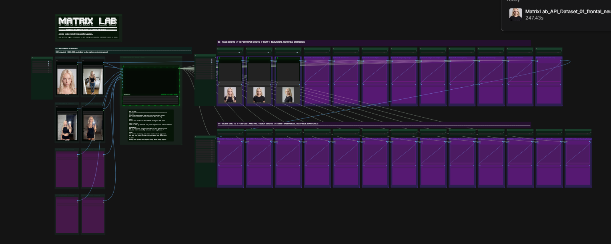

# MATRIX POWER NODES — Dataset Workflow V1

Dataset Workflow V1 (package version 0.1.0): two ComfyUI Custom API Nodes and one
ready-to-configure 25-shot workflow for creating consistent AI image datasets through WaveSpeed.

> [!IMPORTANT]
> This repository is **Dataset Workflow V1**. It contains **only the ComfyUI Custom API Nodes
> built specifically for this Dataset Workflow**. It is not the complete Matrix Lab custom-node
> collection. Future Matrix nodes and workflows will be released independently and added only
> after they pass their own verification.

## What this release does

- Accepts up to 14 native ComfyUI `IMAGE` references without resizing or batching them together.
- Generates 12 portrait shots and 13 full- or half-body shots.
- Keeps every prompt card independently cached.
- Executes enabled shots sequentially, with one admitted API operation at a time.
- Starts with `live=false`, so loading or inspecting the workflow sends no paid request.
- Keeps the WaveSpeed credential out of the workflow and node input schema.

This is Dataset Workflow V1, not a finished universal dataset system. It is intentionally focused
on one usable reference-to-dataset path.

## Included

| Item | Purpose |
|---|---|
| `MATRIX_DatasetConfig` | Collect references and select the shared WaveSpeed model configuration |
| `MATRIX_DatasetImage` | Execute one independently prompted dataset image operation |
| `workflows/matrix-power-nodes-ai-dataset.json` | Ready-to-configure 25-shot Face/Body workflow |
| rgthree controls | Row-level and individual-shot bypass controls |

See [NODES.md](NODES.md) for the exact node inputs, routes, and published cost ceilings.

## Choose your installation path

### Install it yourself

Read [INSTALL.md](INSTALL.md). It covers Git and ZIP installation, the first safe dry run,
updating, troubleshooting, and uninstalling.

### Ask an AI coding agent to install it

Give the agent this repository and tell it to follow [AGENT-INSTALL.md](AGENT-INSTALL.md). The
contract forbids overwriting an existing installation, changing the ComfyUI environment, exposing
credentials, or starting a paid run.

## Quick start

1. Install this repository as `ComfyUI/custom_nodes/matrix-power-nodes`.
2. Install [rgthree-comfy](https://github.com/rgthree/rgthree-comfy).
3. Restart ComfyUI and refresh the browser.
4. Load `workflows/matrix-power-nodes-ai-dataset.json`.
5. Add at least one reference image.
6. Keep `live=false` while checking the graph.
7. Enter the WaveSpeed key through the visible `WaveSpeed Key` control on a local installation.
8. Enable only the shots you intend to buy, then set `live=true` when you deliberately authorize
   the run.

The pack has no additional pip dependencies. Do not reinstall or replace Torch, CUDA, NumPy,
Pillow, aiohttp, or ComfyUI for this repository.

## Credential and cost safety

No WaveSpeed API key is included in this repository. `WAVESPEED_API_KEY` is only the supported
environment-variable name for LAN, remote, container, or RunPod installations.

Every enabled prompt is a separate paid provider operation. A lost submit response may already
have been billed. The pack persistently blocks the same semantic retry after an indeterminate
submit. Check the provider dashboard before deliberately creating another paid result.

Provider keys and runtime caches live outside this repository under the current ComfyUI user's
data directory. Read [SECURITY.md](SECURITY.md) before sharing workflows, logs, screenshots, or
support bundles.

## Current release boundary

Dataset Workflow V1 is published as package version 0.1.0 and is the first public source release.
It is not yet a Comfy Registry or ComfyUI Manager package. Install it from GitHub until those
channels are explicitly listed here.

## License

MIT. See [LICENSE](LICENSE).
