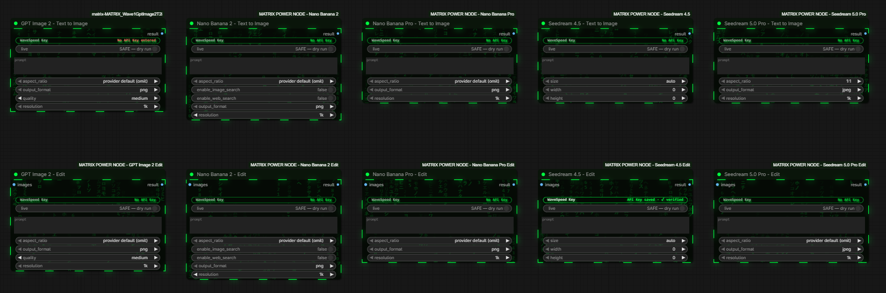

# MATRIX POWER NODES — Wave 1

Ten production-tested ComfyUI nodes for WaveSpeed image generation and image editing. One secure
in-canvas key flow, explicit spend control, native ComfyUI `IMAGE` sockets, and safe-by-default
workflows.



## Included nodes

| Model | Text to Image | Edit |
|---|---|---|
| GPT Image 2 | Yes | Yes |
| Nano Banana 2 | Yes | Yes |
| Nano Banana Pro | Yes | Yes |
| Seedream 4.5 | Yes | Yes |
| Seedream 5.0 Pro | Yes | Yes |

## Install

Download the `v1.0.0` release ZIP, extract it outside ComfyUI, then run:

```powershell
.\scripts\install.ps1 -ComfyUIRoot C:\ComfyUI
```

Linux/macOS:

```bash
./scripts/install.sh /path/to/ComfyUI
```

The installers stop if any target pack already exists. They do not merge, overwrite, delete,
install Python packages, or modify ComfyUI itself. Manual and AI-agent instructions are in
[INSTALL.md](INSTALL.md) and [AGENTS.md](AGENTS.md).

## Add the WaveSpeed key

1. Restart ComfyUI and refresh node definitions.
2. Add any MATRIX POWER NODE to the canvas.
3. Click the green `enter WaveSpeed Key` row.
4. Enter the key in the temporary password field and select `Save key`.
5. Confirm that the row reports `API Key saved · verified`.

Empty Save reports `No API Key entered`. Cancel leaves the credential unchanged. Collapsing the
node closes the dialog. The key is stored through the local credential ABI v2 endpoint and is not
part of the workflow or prompt graph.

## Spend safety

Every node defaults to `live=false`. A provider request can occur only after a user deliberately
sets `live=true` and queues the workflow. WaveSpeed pricing and availability can change; check the
provider before a live run.

## Verification

Version `v1.0.0` passed 10/10 headed ComfyUI UI checks, 10/10 safe UI runs with zero provider
submissions, 10/10 explicitly authorized live smoke runs, and 10/10 zero-submit restart replays.
See [VERIFICATION.md](VERIFICATION.md) for the exact public-safe claims.

## Support

Open a GitHub issue with the node name, ComfyUI version, and redacted error details. Never include
an API key, credential file, request body, or private image.
