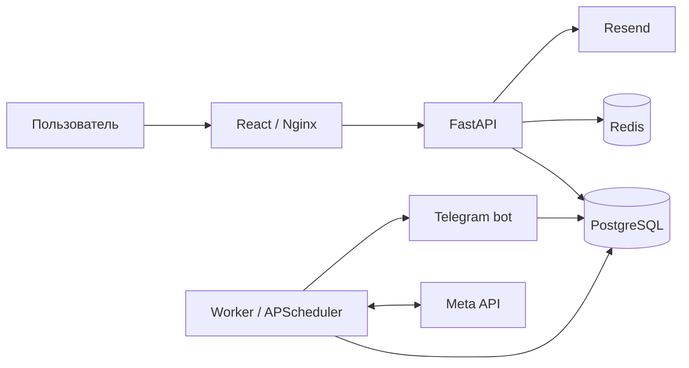

# Архитектура Buyerly

Сверено с исходным кодом после удаления legacy UI в PR #140. Этот документ описывает реализацию, а не доступность внешнего Meta-приложения.

## Контуры системы

Состав production задаёт [docker-compose.yml](../docker-compose.yml): `web`, `api`, `bot`, `worker`, `db`, `redis` и одноразовый `migrate`. Точки запуска находятся в `services/`. Образ Python использует Python 3.12, frontend собирается на Node.js 22. PostgreSQL 16 хранит данные, Redis обслуживает общий rate limit.

## Frontend и HTTP

[App.tsx](../frontend/src/App.tsx) собирает React-приложение; [routing.ts](../frontend/src/lib/routing.ts) определяет публичные и workspace-маршруты. Основные разделы — Inbox, Ads Manager, Rules, Statistics и Settings. Состояние UI хранится в Zustand, HTTP-запросы проходят через [api.ts](../frontend/src/lib/api.ts).

Vite собирает `frontend/dist`; Nginx отдаёт файлы и проксирует API. Юридические страницы и их ресурсы находятся в `frontend/public`. При `SERVE_STATIC=true` FastAPI может отдавать локальный React build и юридические документы. Runtime-каталог `uploads/` монтируется в production как именованный том `buyerly-uploads`; публичные URL начинаются с `/uploads/`.

## Данные и доступ

[database/models.py](../database/models.py) определяет пользователей, workspace, членство и приглашения; Meta connections и assets; рекламные кабинеты; правила и группы; analytics facts, snapshots, аудит и состояние выполнения.

`workspace_id` ограничивает доступ к бизнес-данным. Членство задаёт роль `owner`, `admin`, `buyer` или `viewer`; backend проверяет права при чтении и изменениях. `owner_user_id` не заменяет workspace-проверку.

Основной web-вход использует email-ссылку или OTP и создаёт серверную сессию. В БД хранится хэш секрета, browser cookie защищена HttpOnly, изменения через cookie требуют CSRF. В [api/auth.py](../api/auth.py) также остаются Telegram initData и переходная обработка legacy bearer token; их наличие не означает сохранение старого интерфейса.

Схема развивается через Alembic. Production migration runner применяет миграции под advisory lock; создание схемы через приложение не заменяет этот путь.

## Подключение Meta и аналитика

[api/meta_oauth.py](../api/meta_oauth.py) реализует OAuth, invite-ссылки подключения, discovery, импорт, проверку и отключение. Секреты шифруются на сервере. Фактический доступ внешних профилей зависит от конфигурации и разрешений Meta, которые нельзя установить по наличию кода.

[meta_api/client.py](../meta_api/client.py) получает inventory и Insights, нормализует метрики, обрабатывает квоты и ошибки. Inventory и метрики периода имеют разное происхождение: отсутствие активности не означает отсутствие рекламной сущности.

[services/analytics_store.py](../services/analytics_store.py) сохраняет и читает `AnalyticsEntityFact`. React Statistics использует `/api/analytics/hierarchy`. Старый account-level API `/api/summary` и `SummarySnapshot` продолжают существовать на backend; это не отдельный текущий React-экран. Справочник маршрутов — [API.md](API.md).

## Правила и worker

Правило хранится как `RulePreset`; при назначении его snapshot записывается в `Account.active_rules`. Область назначения сохраняется отдельно от определения правила. Редактирование preset обновляет назначения, сохраняя их scope.

[rules/engine.py](../rules/engine.py) вычисляет условия без сетевых запросов. [scheduler/worker.py](../scheduler/worker.py) загружает данные и расписание, выбирает подлежащие проверке правила и выполняет результат в Meta. Уровни — campaign, adset и ad; бюджетные действия ограничены adset.

`AutomationScheduleState` хранит расписание. `RuleExecutionState` хранит попытки, PENDING, cooldown и подтверждение STOP; сверка после неопределённого результата уменьшает риск повторной мутации. Cooldown может быть нулевым: механизм не гарантирует паузу между всеми успешными срабатываниями.

Отдельное минутное задание обрабатывает локальную смену суток кабинета по timezone Meta. Liveness heartbeat процесса и состояние полного цикла — разные сигналы; наличие heartbeat само по себе не доказывает успешную проверку всех кабинетов.

## Аудит и отмена

`AuditEvent` хранит события workspace и сведения о результате. Inbox читает `/api/audit-events`; это журнал активности, без вымышленных состояний прочтения или архивации.

[core/action_undo.py](../core/action_undo.py) проверяет workspace, успешность исходного действия, окно 24 часа, последующие изменения и текущее состояние Meta. Отмена поддерживаемого действия создаёт отдельное событие.

## Эксплуатация

Тесты и сборка выполняются только в GitHub Actions. Деплой main зависит от успешных тестов и выполняет серверные проверки. Подробности: [DEPLOYMENT.md](DEPLOYMENT.md), [INCIDENT_RUNBOOKS.md](INCIDENT_RUNBOOKS.md), [RELIABILITY_SLO.md](RELIABILITY_SLO.md). История прежней архитектуры сохранена в [архиве](archive/README.md).
