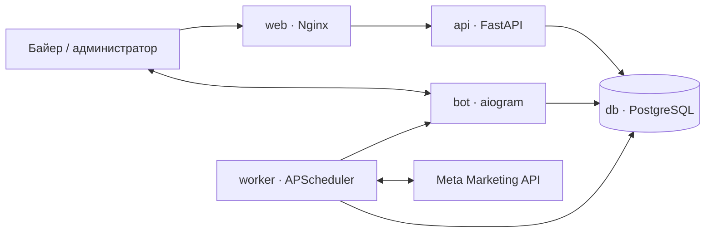

# Архитектура Buyerly

## Контуры системы

Продакшен состоит из независимых сервисов:

- `web` отдаёт интерфейс и направляет `/api/*` и `/health/*` в API;
- `api` отвечает за авторизацию, кабинеты, правила, группы правил, сводки и аудит;
- `bot` обрабатывает Telegram-команды и интерактивные действия;
- `worker` раз в минуту определяет, какие кабинеты и правила пора проверить, работает с Meta и сохраняет результат;
- `db` хранит данные в PostgreSQL 16;
- `migrate` — одноразовый процесс подготовки схемы и переноса прежней SQLite-базы.

Такое разделение не даёт сбою Telegram polling или фоновой проверки уронить веб-интерфейс. API можно проверять отдельно через `/health/live` и `/health/ready`.

## Данные

SQLAlchemy-модели находятся в `database/models.py`:

- `TelegramUser` — пользователь, роль и доступ;
- `Account` — Meta-кабинет, владелец, статус, источник подключения, собственное название, рабочая заметка и назначенные правила;
- `AccountGroup` и `AccountGroupMember` — собственная именованная many-to-many группировка кабинетов для аналитических срезов;
- `RulePreset` — исполняемое правило;
- `RuleGroup` и `RuleGroupItem` — переиспользуемая упорядоченная группа правил;
- `RuleExamplesBootstrap` — одноразовый маркер создания удаляемой библиотеки примеров владельца;
- `StoppedAdSet` — внутреннее состояние выполненной остановки, а не очередь подтверждения;
- `SummarySnapshot` — сохранённая сводка Meta для конкретного пользователя и периода, включая полные значения кабинетов без секретов;
- `AnalyticsViewPreference` — сохранённое представление аналитики пользователя: видимость, порядок и ширина колонок, сортировка, фильтры и период;
- `AuditEvent` — неизменяемая история действий продукта;
- `AutomationScheduleState` — долговечное расписание кабинетов и правил;
- `RuleExecutionState` — идемпотентный слот выполнения правила с состоянием до/после;
- `ActionUndoState` — блокировка и результат единственной безопасной отмены;
- `EventLog` — история доставки уведомлений;
- `AppSettings` — общие настройки мониторинга, параллельности, кэша и защиты квоты;
- `AutomationRuntimeState` — последний безопасный heartbeat полного цикла worker для интерфейса.

Владение бизнес-данными опирается на неизменяемый `TelegramUser.id` (`owner_user_id`). Поле `owner_id` сохраняется как совместимая историческая метка, а `telegram_id` является изменяемым адресом доставки. Поэтому смена Telegram ID не переносит и не скрывает кабинеты, правила, снимки или историю.

Первый переход на PostgreSQL выполняется транзакционно. Копирование начинается только в пустую целевую базу, после чего количество строк сверяется по каждой таблице. При ошибке транзакция откатывается, а прежний контейнер можно вернуть.

## Локальная граница суток кабинета

Worker содержит отдельное минутное задание для календарной границы суток. Оно проходит по всем подключённым кабинетам независимо от Spend, состояния рекламы и включения автоправил. Источник часового пояса — поле `timezone_name` рекламного кабинета из Meta; известные legacy-имена IANA, например `US/Hawaii`, сохраняются в каноническом виде `Pacific/Honolulu`.

`Account.last_day_start_date` хранит последнюю обработанную локальную дату. При первом наблюдении дата только инициализируется без уведомления, чтобы deploy посреди дня не создавал ложный старт. На смене даты в пятиминутном окне после 00:00 создаётся `AuditEvent` типа `ACCOUNT_DAY_STARTED` и отправляется Telegram-сообщение с датой, временем, зоной и UTC-смещением. Повторный минутный цикл или restart не создаёт дубль. Если worker был недоступен всё полуночное окно, дата догоняется без позднего сообщения. Неизвестная зона не подменяется UTC: кабинет пропускается с диагностической ошибкой.

Поле `last_started_date` оставлено только для совместимости со старой схемой. Прежняя эвристика «первый ненулевой Spend означает начало открута» больше не исполняется.

## Жизненный цикл сводки

`GET /api/summary?period=...` сначала проверяет короткий кеш процесса, затем последний снимок в PostgreSQL. Это позволяет мгновенно восстановить экран после перезагрузки без нового обращения к Meta. `force=true` получает account-level Insights из Meta, формирует новый снимок и возвращает ссылку на предыдущие итоговые значения. Интерфейс мгновенно отображает сохранённый снимок из базы и запрашивает свежие данные Meta строго по кнопке пользователя с ограничением параллелизма (семафор) и защитой от перегрузки Graph API, никогда не заменяя успешный снимок пустым экраном при временной ошибке.

История ограничена 100 снимками на пользователя и период. В JSON снимка не попадают access token, авторизационные данные или другие секреты.

Список «Мои кабинеты» присоединяет к каждому кабинету его последний сохранённый `SummarySnapshot` за сегодня. Он не обращается к Meta при открытии страницы: пользователь видит Spend и этапы воронки вместе со временем снимка и явным состоянием данных. `meta_connection_id` определяет отображаемый источник `Facebook Login`; отсутствие связи означает резервное ручное подключение `System User`. Собственное название и заметка принадлежат Buyerly и не изменяют данные рекламного кабинета в Meta.

Группы кабинетов принадлежат пользователю и связываются с кабинетами через отдельную many-to-many таблицу. Один кабинет может состоять в нескольких группах; удаление группы удаляет только связи. «Мои кабинеты» управляет составом групп, а сводка использует выбранную группу как глобальный срез уже полученного snapshot: одинаковый набор строк определяет KPI, валютные итоги, покрытие данных и таблицу. Переключение группы не обращается к Meta и поэтому не увеличивает API-нагрузку.

Account-level запрос включает только видимые в текущем интерфейсе лёгкие поля: Spend, Impressions, Reach, Frequency, CPM, All/Unique/Inline Link/Outbound Clicks и Actions. Landing Page Views и события воронки извлекаются из Actions с канонической дедупликацией. Производные показатели рассчитываются из итоговых сумм, а не усреднением процентов отдельных кабинетов.

Каждый `Account` хранит ISO-код валюты, полученный из Meta. При единой валюте API рассчитывает общий Spend и стоимостные метрики. При нескольких валютах общий денежный итог намеренно недоступен, а `currency_totals` содержит отдельные суммы. `UNKNOWN` не подменяется USD: worker уточняет такую валюту ближайшим циклом, а до этого денежные автодействия блокируются. Бюджет и его пределы интерпретируются в валюте кабинета; валюты без дробных minor units передаются Meta без деления или умножения на 100.

## Представления аналитики

`GET /api/analytics-view` возвращает сохранённое представление текущего пользователя, а `PUT /api/analytics-view` сохраняет выбранный готовый вид, ручной набор, порядок и ширину колонок, сортировку, поисковый запрос, фильтры качества данных/группы и период отчёта. Ширину можно менять ползунком в настройках или напрямую перетаскиванием правой границы заголовка; во время движения обновляется только геометрия таблицы, а запись в API выполняется после завершения жеста. Настройки изолированы по владельцу и не содержат рекламные данные или секреты. Кабинет и статус данных остаются обязательными колонками, чтобы таблица никогда не теряла контекст и признаки качества данных. Собственное название и заметка доступны как обычные включаемые колонки. API принимает только известные ключи, ограничивает ширину диапазоном 72–420 px и автоматически дополняет старые настройки новыми полями.

Системный полный вид и период «Сегодня» используются до первого сохранения. Готовые представления «Обзор», «Доставка», «Трафик» и «Воронка», поиск, фильтр статуса и сортировка меняют только рабочую разбивку по кабинетам; верхние KPI, определения метрик, время обновления и показатели качества остаются на месте. При следующем входе сначала восстанавливается сохранённый период, и только затем запрашивается соответствующий снимок сводки.

## Маршрутизация web-интерфейса

Основные разделы имеют стабильные адреса: `/accounts`, `/rules`, `/summary`, `/logs`, `/add-accounts` и `/settings`. Интерфейс переключает разделы через History API без полной перезагрузки, а Nginx и локальный FastAPI fallback возвращают `index.html` при прямом открытии каждого адреса. Поэтому обновление страницы сохраняет открытый раздел, прямую ссылку можно передать коллеге, а системные кнопки браузера «назад» и «вперёд» работают ожидаемо.

Маршрут применяется только после успешной авторизации. При истёкшей сессии запрошенный раздел временно сохраняется в `sessionStorage`, пользователь переходит на `/sign-in`, а после повторного входа возвращается на исходную страницу. Выход из аккаунта намеренно очищает этот переход и открывает страницу входа.

## Автоправила

`MonitoringWorker` выбирает активные кабинеты, рассчитывает срок следующей проверки для каждого правила и запрашивает Meta только для тех правил, которым уже пора выполняться. STOP-правила ограничены отдельным коротким интервалом, а здоровье кабинета проверяется по более редкому независимому расписанию. Расписание хранится в `AutomationScheduleState`, поэтому deploy не запускает все правила повторно. `RuleEngine` вычисляет условия без сетевых вызовов.

Перед любым STOP движок применяет защиту воронки: наличие регистрации или покупки в текущем Ads Insights подавляет выключение независимо от состава условий. Разрешённый STOP проходит долговечное состояние `STOP_CONFIRMING`: условие должно повторяться без слишком большого разрыва в течение глобального окна 0–60 минут. Если промежуточная проверка перестала совпадать, ожидание сбрасывается. Первый кандидат фиксируется в аудите, но не меняет Meta. Источник защиты — Meta Ads Insights; внешний tracker становится источником истины только после отдельной интеграции.

Сетевой этап читает несколько кабинетов параллельно через ограниченный semaphore. Внутри кабинета список ad set и текущие статусы кэшируются на короткий настраиваемый срок, поэтому разные отчётные окна повторно получают только Insights. `MetaClient` держит общий пул HTTP-соединений, подписывает запросы `appsecret_proof`, повторяет только временные ошибки с backoff/`Retry-After` и собирает безопасную телеметрию квоты из заголовков Meta. Мягкий лимит добавляет паузу фоновым запросам, жёсткий откладывает некритичную работу; критические STOP-проверки и изменения статуса сохраняют приоритет.

После полного цикла worker записывает в `AutomationRuntimeState` начало, завершение, длительность, количества кабинетов/правил/ad set, число действий и ошибок, а также процент использования квоты. Веб показывает этот снимок на отдельной странице «Автоматика Meta» внутри настроек. Изменить глобальные параметры может только администратор после повторной проверки текущего пароля учётной записи.

Перед любым действием создаётся или блокируется `RuleExecutionState` с состоянием `PENDING`, фактическим состоянием до действия и ожидаемым состоянием после него. Только владелец этой блокировки обращается в Meta. Успех переводит запись в `SUCCESS`, ошибка — в `ERROR`, а cooldown сверяется с последним сохранённым успехом. Если процесс остановился после ответа Meta, следующий worker сравнивает текущий status/budget с ожидаемым, подтверждает успех и не повторяет действие. Любое реальное действие и ошибка записываются в `AuditEvent` независимо от доставки Telegram-уведомления.

Поддерживаются действия `turn_off`, `turn_on`, `notify_only`, `increase_budget`, `decrease_budget`, логика `AND`/`OR`, интервалы проверки и cooldown.

Payload правила валидируется одной fail-closed моделью в API и worker: неизвестное действие, метрика, оператор, логика, окно, пустое условие, `NaN`/бесконечность и небезопасный бюджет не превращаются в действие по умолчанию. При миграции старый некорректный snapshot выключается и требует ручного пересохранения.

Первый запрос списка правил или групп атомарно создаёт личную библиотеку из шести примеров и двух групп. Примеры не назначаются кабинетам. `RuleExamplesBootstrap` фиксирует завершение операции, поэтому пользователь может удалить всё лишнее без повторного восстановления системой.

## История и отмена

После подтверждённого ответа Meta действие сразу получает `SUCCESS` и показывается как «Выполнено»; ручного подтверждения нет. История append-only и объединяет worker, web и Telegram.

Отмена создаёт отдельное связанное событие и возможна только для последнего успешного изменения конкретного ad set в течение 24 часов. Перед обратным вызовом API повторно проверяет владельца, обратимость, отсутствие нового действия и текущее состояние Meta. `ActionUndoState` защищает от параллельного или повторного вызова. STOP отменяется START, START — STOP, бюджет возвращается к точному `before_state`; уведомления и ошибки не отменяются.

## Границы доступа

Обычный байер видит и изменяет только свои кабинеты, правила, группы и историю. Администратор имеет общий обзор. Веб принимает подписанные данные Telegram или постоянный токен входа. Секреты Meta и Telegram удаляются из журналов форматтером до записи на диск. Полный HTTP-контракт описан в [API.md](API.md).
