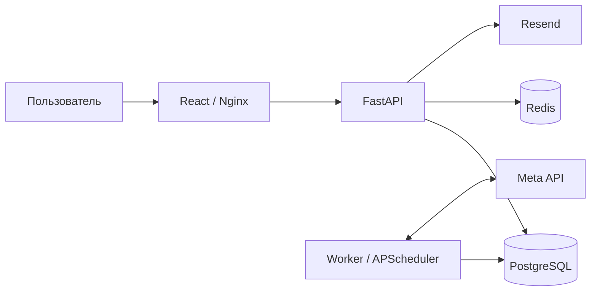

# Архитектура Buyerly

Сверено с исходным кодом после удаления legacy UI в PR #140. Этот документ описывает реализацию, а не доступность внешнего Meta-приложения.

## Контуры системы

```mermaid
flowchart LR
    U[Пользователь] --> W[React / Nginx]
    W --> A[FastAPI]
    A --> D[(PostgreSQL)]
    A --> R[(Redis)]
    A --> E[Resend]
    K[Worker / APScheduler] --> D
    K <--> M[Meta API]
```

Состав production задаёт [docker-compose.yml](../docker-compose.yml): `web`, `api`, `worker`, `db`, `redis` и одноразовый `migrate`. Точки запуска находятся в `services/`. Образ Python использует Python 3.12, frontend собирается на Node.js 22. PostgreSQL 16 хранит данные, Redis обслуживает общий rate limit.

## Frontend и HTTP

[App.tsx](../frontend/src/App.tsx) собирает React-приложение; [routing.ts](../frontend/src/lib/routing.ts) определяет публичные и workspace-маршруты. Основные разделы — Inbox, Ads Manager, Rules и Settings. Состояние UI хранится в Zustand, HTTP-запросы проходят через [api.ts](../frontend/src/lib/api.ts).

Vite собирает `frontend/dist`; Nginx отдаёт файлы и проксирует API. Юридические страницы и их ресурсы находятся в `frontend/public`. При `SERVE_STATIC=true` FastAPI может отдавать локальный React build и юридические документы. Runtime-каталог `uploads/` монтируется в production как именованный том `buyerly-uploads`; публичные URL начинаются с `/uploads/`.

## Данные и доступ

[database/models.py](../database/models.py) определяет пользователей, workspace, членство и приглашения; Meta connections и assets; рекламные кабинеты; правила и группы; analytics facts, snapshots, аудит и состояние выполнения.

`workspace_id` ограничивает доступ к бизнес-данным. Членство задаёт роль `owner`, `admin`, `buyer` или `viewer`; backend проверяет права при чтении и изменениях. `owner_user_id` не заменяет workspace-проверку.

Основной web-вход использует email-ссылку или OTP и создаёт серверную сессию. В БД хранится хэш секрета, browser cookie защищена HttpOnly, изменения через cookie требуют CSRF. В [api/auth.py](../api/auth.py) также остаётся переходная обработка legacy bearer token; её наличие не означает сохранение старого интерфейса.

Схема развивается через Alembic. Production migration runner применяет миграции под advisory lock; создание схемы через приложение не заменяет этот путь.

## Подключение Meta и аналитика

[api/meta_oauth.py](../api/meta_oauth.py) реализует OAuth, invite-ссылки подключения, discovery, импорт, проверку и отключение. Секреты шифруются на сервере. Фактический доступ внешних профилей зависит от конфигурации и разрешений Meta, которые нельзя установить по наличию кода.

[meta_api/client.py](../meta_api/client.py) получает inventory и Insights, нормализует метрики, обрабатывает квоты и ошибки. Inventory и метрики периода имеют разное происхождение: отсутствие активности не означает отсутствие рекламной сущности.

[services/analytics_store.py](../services/analytics_store.py) сохраняет и читает `AnalyticsEntityFact`. Ads Manager и WebMCP читают его через `/api/analytics/hierarchy`. Старый account-level API `/api/summary` и `SummarySnapshot` продолжают существовать на backend; это не отдельный текущий React-экран. Справочник маршрутов — [API.md](API.md).

Страница поиска `/<workspace>/search` (`/` и кнопка Search workspace) ищет по Enter через `GET /api/search` ([api/routers/search.py](../api/routers/search.py)): кампании, ad sets и объявления из сегодняшнего инвентаря `AnalyticsEntityFact` по часам каждого кабинета (того же, что показывает Ads Manager), правила и рекламные кабинеты workspace из адреса. Результат открывается по каноническому адресу записи, и список показывает её строку.

## Правила и worker

Правило хранится как `RulePreset`; при назначении его snapshot записывается в `Account.active_rules`. Область назначения сохраняется отдельно от определения правила. Редактирование preset обновляет назначения, сохраняя их scope.

[rules/engine.py](../rules/engine.py) вычисляет условия без сетевых запросов. [scheduler/worker.py](../scheduler/worker.py) загружает данные и расписание, выбирает подлежащие проверке правила и выполняет результат в Meta. Уровни — campaign, adset и ad; бюджетные действия ограничены adset.

`AutomationScheduleState` хранит расписание. `RuleExecutionState` хранит попытки, PENDING, cooldown и подтверждение STOP; сверка после неопределённого результата уменьшает риск повторной мутации. Cooldown может быть нулевым: механизм не гарантирует паузу между всеми успешными срабатываниями. Пока правило ждёт конца cooldown, оно не начинает подтверждение STOP и не пишет пропуски в историю.

Если на одну сущность сработало несколько правил (`RuleEngine.evaluate_all`), каждое правило «только уведомлять» срабатывает само по себе и со своим cooldown. Из действий, которые меняют сущность, за проверку выполняется одно: берётся самый сильный вид (STOP, затем уменьшение бюджета, затем увеличение), и из правил этого вида — первое, которое не на cooldown. Более слабое действие не подменяет сильное, пока то на cooldown (запись №47).

Действие правила, отменённое байером, до конца суток по часам кабинета не повторяется над той же сущностью: worker находит такие отмены в `audit_events` (успешное `UNDO_ACTION`, чьё исходное событие — `RULE_ACTION` системы) и не передаёт движку правила с этим действием для этой сущности.

[scripts/rule_simulator.py](../scripts/rule_simulator.py) — тренажёр правил: прогоняет настоящий worker, движок и подтверждение STOP по выдуманному кабинету поминутно (задержка отчётов Meta задаётся) на одноразовой `buyerly_test` и сравнивает, на каком долларе адсет выключает Buyerly и на каком — байер, который следует тем же правилам. Правила по умолчанию — памятка NL-байера. Цифры тренажёра выдуманы: он проверяет поведение, а не пользу на живом кабинете.

Отдельное минутное задание обрабатывает локальную смену суток кабинета по timezone Meta. Liveness heartbeat процесса и состояние полного цикла — разные сигналы; наличие heartbeat само по себе не доказывает успешную проверку всех кабинетов.

## Аудит и отмена

`AuditEvent` хранит события workspace и сведения о результате. Inbox читает `/api/audit-events`; это журнал активности, без вымышленных состояний прочтения или архивации.

[core/action_undo.py](../core/action_undo.py) проверяет workspace, успешность исходного действия, окно 24 часа, последующие изменения и текущее состояние Meta. Отмена поддерживаемого действия создаёт отдельное событие.

## ИИ-агент в браузере (WebMCP)

[frontend/src/webmcp/](../frontend/src/webmcp/) предлагает ИИ-агенту браузера инструменты открытого workspace через WebMCP (`document.modelContext.registerTool`): агент вызывает готовые действия Buyerly вместо поиска кнопок на экране. Нового backend API нет, только отметка: записи агента несут заголовок `X-Buyerly-Agent: webmcp`, и по нему `api/routers/rules.py` оставляет в Inbox строку `ASSISTANT_CREATE_RULE`, `ASSISTANT_ATTACH_RULE` или `ASSISTANT_DETACH_RULE` (категория `MANUAL_ACTION`, `details.via = "webmcp"`). Такие же изменения, сделанные человеком на странице Rules, в Inbox не пишутся. Заголовок ничего не доказывает, он только объясняет в истории, кто попросил изменение. Каждый инструмент вызывает тот же `/api/*`, что и интерфейс, поэтому сессия, CSRF, `X-Workspace-Slug` и серверные проверки роли действуют как обычно: агент может ровно то, что может этот человек.

[register.ts](../frontend/src/webmcp/register.ts) регистрирует инструменты, только если браузер поддерживает WebMCP (`document.modelContext`, в Chrome 149 — `navigator.modelContext`) и функция включена: сборкой с `VITE_WEBMCP=1` или в отдельном браузере через `localStorage.setItem('buyerly-webmcp', 'on')`. В production она выключена до ручной проверки. Инструменты живут, пока открыт их workspace: при смене workspace их снимает `AbortSignal`, а каждый запрос ещё раз проверяет, что workspace тот же. WebMCP в Chrome пока работает только с флагом `chrome://flags/#enable-webmcp-testing` или с токеном origin trial (Chrome 149–156). Токен для `https://buyerly.app` лежит в `frontend/index.html` и действует до 2026-11-17, на других адресах Chrome его игнорирует. Просроченный токен Chrome молча игнорирует, поэтому напоминанием служит [tests/test_webmcp_origin_trial.py](../tests/test_webmcp_origin_trial.py): он читает срок из самого токена и падает, когда срок прошёл, — тогда токен нужно продлить или убрать. Токен только открывает `document.modelContext` без флага, а инструменты по-прежнему включаются сборкой или через `localStorage`.

Инструменты ([tools.ts](../frontend/src/webmcp/tools.ts)):

- чтение: `list_ad_accounts`, `get_performance`, `list_rules`, `list_recent_rule_actions`, `list_stopped_adsets`, `describe_rule_options`;
- изменения: `create_rule` (по умолчанию `notify_only`, `turn_off` — только по явной просьбе человека), `attach_rule` (только правила-уведомления и выключения), `detach_rule`.

Перед каждым изменением человек видит окно Buyerly ([ApprovalDialog.tsx](../frontend/src/webmcp/ApprovalDialog.tsx)). Текст в нём строится из самого запроса, а не из слов агента. Параметра, пропускающего подтверждение, нет. Кнопка подтверждения становится активной через 600 мс и не срабатывает от `click()` из скрипта, а Enter и Esc отклоняют. Отказ возвращается агенту как `{"error": "User declined"}`. Подтверждённое изменение попадает в Inbox строкой «AI assistant created / attached / detached a rule» (см. выше про `X-Buyerly-Agent`).

Агенту сознательно не даны: включение и выключение автоматизации, пауза и запуск рекламы, бюджеты, бюджетные правила и правила включения, удаление правил, undo, участники, приглашения и подключения Meta. Это деньги и доступы, и решение о них остаётся за человеком в интерфейсе.

В своём браузере человек включает инструменты переключателем «Let your browser's AI assistant use Buyerly» в Settings → Preferences ([PreferencesView.tsx](../frontend/src/components/preferences/PreferencesView.tsx)). Он пишет тот же ключ `buyerly-webmcp` в `localStorage`, и [register.ts](../frontend/src/webmcp/register.ts) (`useWebMcpEnabled`) сразу регистрирует или снимает инструменты открытого workspace, в том числе в других вкладках. В браузере без WebMCP переключатель неактивен.

Chrome не сверяет аргументы агента со схемой и не передаёт агенту текст исключения. Поэтому инструменты проверяют вход сами ([input.ts](../frontend/src/webmcp/input.ts)) и возвращают ошибки значением `{"error", "status"}`. Названия из Meta попадают только в ответы инструментов, как данные с пометкой `untrustedContentHint`, и никогда — в их описания. Проверка — [scripts/webmcp-browser.mjs](../scripts/webmcp-browser.mjs): она работает с настоящим WebMCP, если он есть в браузере, а иначе с заменой, которая ведёт себя так же.

## Эксплуатация

Тесты и сборка выполняются только в GitHub Actions. Деплой main зависит от успешных тестов и выполняет серверные проверки. Подробности: [DEPLOYMENT.md](DEPLOYMENT.md), [INCIDENT_RUNBOOKS.md](INCIDENT_RUNBOOKS.md), [RELIABILITY_SLO.md](RELIABILITY_SLO.md).
