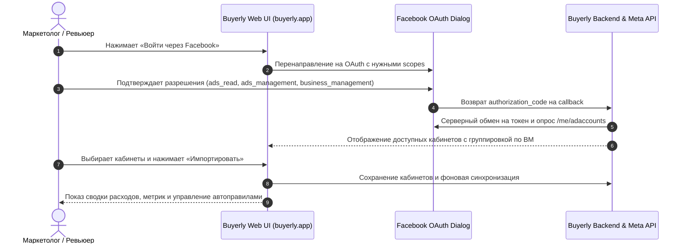

# 📋 Meta App Review Submission Guide & Screencast Script (Buyerly)

> Исторические записи и этапы могут быть заменены последующими изменениями. Текущая архитектура: [ARCHITECTURE.md](ARCHITECTURE.md); актуальные задачи: [PRODUCT_BACKLOG.md](PRODUCT_BACKLOG.md). Статус внешних сервисов проверяется отдельно.

> **Цель:** Официальное прохождение Meta App Review для получения **Advanced Access** к разрешениям Marketing API (`ads_read`, `ads_management`, `business_management`), что позволит любому пользователю/байеру подключать свои рекламные кабинеты к **Buyerly** в 1 клик.

---

## 📑 Содержание

1. [Общая информация о приложении](#1-общая-информация-о-приложении)
2. [Готовые тексты обоснований для Meta (Permissions Justifications)](#2-готовые-тексты-обоснований-для-meta-permissions-justifications)
   - [2.1. `ads_read`](#21-ads_read)
   - [2.2. `ads_management`](#22-ads_management)
   - [2.3. `business_management`](#23-business_management)
3. [Сценарий скринкаста (Screencast Recording Script)](#3-сценарий-скринкаста-screencast-recording-script)
4. [Инструкции для ревьюера Meta (Reviewer Notes & Test User)](#4-инструкции-для-ревьюера-meta-reviewer-notes--test-user)
5. [Чек-лист перед нажатием кнопки «Submit for Review»](#5-чек-лист-перед-нажатием-кнопки-submit-for-review)

---

## 1. Общая информация о приложении

* **App Name:** `Buyerly App` (или `Buyerly MAIN`)
* **App ID:** `1363654095968021`
* **Login Configuration ID:** `1796379231385440`
* **App Domain:** `buyerly.app`
* **Redirect URI:** `https://buyerly.app/api/meta/oauth/callback`
* **Privacy Policy:** `https://buyerly.app/privacy`
* **Terms of Service:** `https://buyerly.app/terms`
* **Data Deletion Instructions:** `https://buyerly.app/data-deletion`
* **Category:** `Utility & productivity` / `Business & Pages`

---

## 2. Готовые тексты обоснований для Meta (Permissions Justifications)

При подаче заявки в **Meta Developer Dashboard** $\rightarrow$ **Use Cases / Permissions and Features** для каждого запрашиваемого права вставляйте соответствующий текст на английском языке:

---

### 2.1. `ads_read`

**Вопрос Meta:** *How will your app use ads_read?*

```text
Buyerly is a media buying analytics and automation platform that helps businesses and marketing teams monitor their Meta ad campaigns in a centralized dashboard.

We use the `ads_read` permission to:
1. Fetch advertising account structures (campaigns, ad sets, and ads) via the Marketing API.
2. Retrieve performance and delivery metrics (Spend, Impressions, Clicks, Leads, Conversions, CPL, CPC, ROAS) using the Meta Insights API.
3. Display real-time KPI summaries and analytics tables so users can evaluate their advertising efficiency without manually logging into multiple Ad Manager accounts.

All retrieved data is strictly displayed to authorized account owners, securely stored, and never shared with third parties.
```

---

### 2.2. `ads_management`

**Вопрос Meta:** *How will your app use ads_management?*

```text
Buyerly provides automated budget protection and rule-based workflow optimization for Meta advertising campaigns.

We use the `ads_management` permission to:
1. Allow users to configure automated rules (e.g., automatically pause an underperforming ad set if Cost Per Lead exceeds a user-defined threshold, or stop campaigns when daily spend limit is reached).
2. Allow users to adjust daily/lifetime budgets and toggle campaign/ad statuses (ACTIVE/PAUSED) directly from the unified Buyerly web application.

Actions are only executed either on explicit user demand or based on strictly defined user-configured automation rules.
```

---

### 2.3. `business_management`

**Вопрос Meta:** *How will your app use business_management?*

```text
Buyerly allows marketing agencies, media buying teams, and multi-brand businesses to organize their advertising assets.

We use the `business_management` permission to:
1. Retrieve the list of Business Managers / Business Portfolios that the authenticated user has access to (via `/me/businesses`).
2. Group discovered ad accounts by their respective Business Manager in the connection onboarding modal.
3. Help users selectively import accounts belonging to specific client or organization portfolios with clear visual hierarchy.

We do not modify business settings or user permissions within the Business Manager; this access is strictly read-only for asset grouping.
```

---

## 3. Сценарий скринкаста (Screencast Recording Script)

> **Формат видео:** MP4 / MOV, разрешение 1080p, длительность **2–3 минуты**.  
> **Язык интерфейса / субтитров:** Английский (или понятные действия с английскими комментариями / текстом).



### Посекундный план записи:

| Время | Экран / Действие | Что говорить / показывать (голосом или текстом) |
|---|---|---|
| **0:00 – 0:30** | Главный экран `buyerly.app` $\rightarrow$ Раздел добавления кабинетов | *«In this video, we demonstrate how Buyerly uses Facebook Login for Business and Marketing API to import and manage ad accounts.»* Нажать кнопку **«Войти через Facebook»**. |
| **0:30 – 1:00** | Официальное окно авторизации Meta | Показать окно согласия Meta, где видны запрашиваемые разрешения (`ads_read`, `ads_management`, `business_management`). Нажать **«Continue as [Name]»**. |
| **1:00 – 1:40** | Экран выбора обнаруженных кабинетов (`business_management` & `ads_read`) | Meta редиректит обратно. Показать модальное окно: *«Ad accounts are grouped by Business Manager using business_management. The user selects specific accounts and clicks Import.»* |
| **1:40 – 2:15** | Сводка и таблица метрик (`ads_read`) | Открыть Dashboard со списком импортированных кампаний/кабинетов. Показать отображение Spend, Leads, CPL, Impressions. *«Here the user views real-time Insights data fetched via ads_read.»* |
| **2:15 – 2:45** | Раздел Автоправил / Управление рекламой (`ads_management`) | Показать создание автоправила (например: *«Pause Ad Set if Spend > $50 and Leads = 0»*) или кнопку переключения статуса кампании. *«ads_management is used to execute automated pause rules and adjust budgets safely.»* |
| **2:45 – 3:00** | Завершение | Показать футер с ссылками на Privacy Policy и Terms. *«All tokens are encrypted and handled in compliance with Meta policies.»* |

---

## 4. Инструкции для ревьюера Meta (Reviewer Notes & Test User)

В поле **«Notes for Reviewer / Instructions to test your app»** укажите:

```text
Testing Instructions for Meta Review Team:

1. Web Application URL: https://buyerly.app
2. Demo / Review Credentials:
   - Login: [Тестовый email для ревьюера, созданный в Buyerly]
   - Password: [Тестовый пароль]
3. How to test Facebook Login:
   - Once logged in, navigate to "/add-accounts" or click "Подключения Meta" / "Add Accounts".
   - Click the "Войти через Facebook" (Log in with Facebook) button.
   - Accept the requested permissions (ads_read, ads_management, business_management).
   - In the modal window, view discovered ad accounts organized by Business Manager.
   - Select one or more accounts and click "Импортировать" (Import).
   - Navigate to the Dashboard to view fetched metrics (ads_read) and Rules to view automation controls (ads_management).

4. Data Privacy:
   - Privacy Policy: https://buyerly.app/privacy
   - Terms of Service: https://buyerly.app/terms
   - User Data Deletion Instructions: https://buyerly.app/data-deletion

If any additional permissions verification or technical demonstration is required, please contact us at hiurano7@gmail.com.
```

---

## 5. Чек-лист перед нажатием кнопки «Submit for Review»

- [x] **App Settings $\rightarrow$ Basic:** Домен `buyerly.app`, Privacy Policy, Terms, Data Deletion URL, иконка и категория заполнены.
- [x] **Facebook Login for Business $\rightarrow$ Settings:** Redirect URI `https://buyerly.app/api/meta/oauth/callback` сохранён, HTTPS и Strict Mode включены.
- [x] **Facebook Login for Business $\rightarrow$ Configurations:** Создана конфигурация `Buyerly Ads Auth` (`1796379231385440`) с правами `ads_read`, `ads_management`, `business_management`.
- [ ] **Business Verification:** В Meta Business Manager запущен/пройден процесс верификации компании (загружена выписка NAPR и банковская справка).
- [ ] **Screencast:** Записано видео 1080p по сценарию выше и загружено в форму заявки Meta (или через приватную ссылку Google Drive / YouTube).
- [ ] **Reviewer Account:** Создан тестовый аккаунт в Buyerly для проверяющего инженера Meta.
- [ ] **Submit:** Нажата кнопка **«Submit for Review»** в Meta Developer Dashboard.
