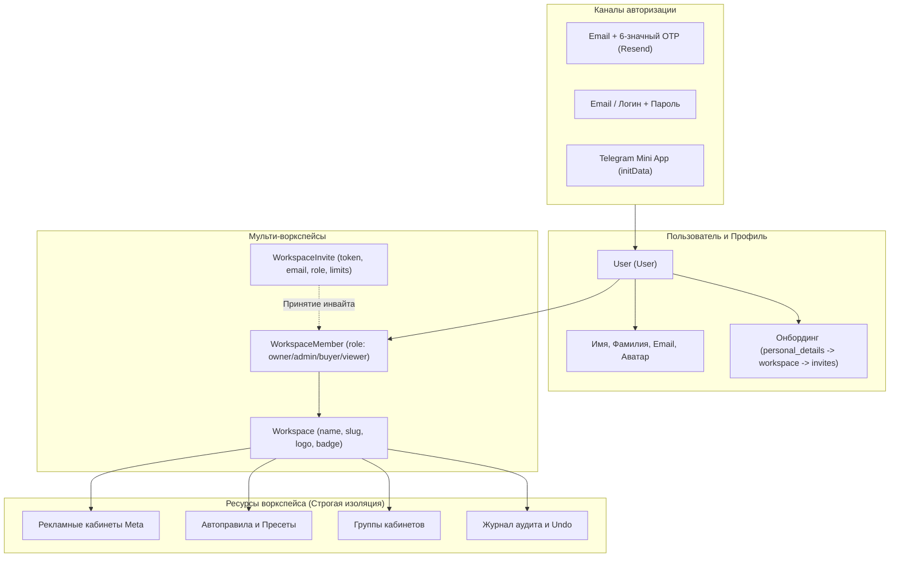
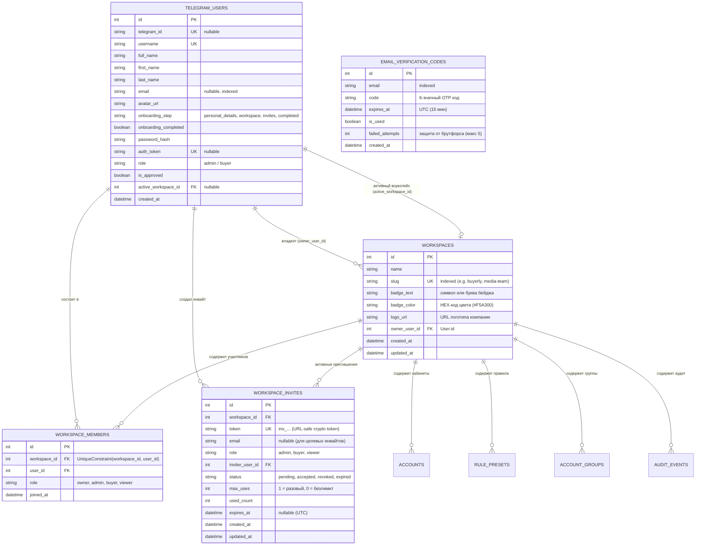

# Воркспейсы, Авторизация, Инвайты и Сервис Resend

В этом документе детально описана архитектура пользователей, мульти-воркспейсов, системы приглашений (Invites), онбординга в стиле Attio CRM и интеграции почтового сервиса Resend.

---

## 1. Обзор архитектуры

Платформа Buyerly построена по принципу **Workspace-First**:
- Каждый пользователь (`User` / `User`) входит в систему через один из каналов аутентификации (Email OTP, Email + пароль или Telegram Mini App).
- Все рабочие сущности (Meta-кабинеты, пресеты автоправил, группы кабинетов, журнал аудита и сводки) изолированы внутри конкретного рабочего пространства (`Workspace`).
- Доступ пользователя к ресурсам воркспейса определяется его членством (`WorkspaceMember`) и назначенной ролью (`owner`, `admin`, `buyer`, `viewer`).



---

## 2. Модели данных и ER-диаграмма

### 2.1. Диаграмма сущностей (Database Schema)



---

## 3. Ролевая модель (RBAC)

Внутри каждого воркспейса действует гранулярное разделение прав:

| Действие / Возможность | Owner (Владелец) | Admin (Админ) | Buyer (Байер) | Viewer (Наблюдатель) |
|---|:---:|:---:|:---:|:---:|
| Просмотр аналитики, сводок и KPI | ✅ | ✅ | ✅ | ✅ |
| Просмотр списка кабинетов и групп | ✅ | ✅ | ✅ | ✅ |
| Добавление и удаление кабинетов Meta | ✅ | ✅ | ✅ | ❌ |
| Создание, редактирование и запуск правил | ✅ | ✅ | ✅ | ❌ |
| Создание групп кабинетов | ✅ | ✅ | ✅ | ❌ |
| Отмена действий автоматики (Undo) | ✅ | ✅ | ✅ | ❌ |
| Создание инвайтов в команду | ✅ | ✅ | ❌ | ❌ |
| Управление ролями участников | ✅ | ✅ (кроме Admin/Owner) | ❌ | ❌ |
| Исключение участников из воркспейса | ✅ | ✅ (кроме Admin/Owner) | ❌ | ❌ |
| Настройки воркспейса (имя, лого, слаг) | ✅ | ✅ | ❌ | ❌ |
| Передача прав владения (`transfer-ownership`) | ✅ | ❌ | ❌ | ❌ |
| Удаление воркспейса | ✅ | ❌ | ❌ | ❌ |

---

## 4. Аутентификация и безопасность сессий

### 4.1. Passwordless Email и Telegram

1. **Закрытый вход по email**:
   - `/login` содержит только кнопку `Continue with email`; свободной регистрации, Google, SSO, passkey и публичного password-flow нет.
   - `POST /api/auth/request-temporary-password` разрешён только адресу из whitelist или пользователю активного invite. Invite-контекст сохраняется вместе с credential.
   - Resend отправляет одно письмо с одноразовой ссылкой `/auth/email/verify?token=…` и соответствующим 6-значным кодом.
   - В базе сохраняются только HMAC-хэши ссылки и кода, назначение, scope, invite и срок жизни 15 минут. Тело письма и OTP-код не журналируются.
   - `POST /api/auth/verify-email-link` и `POST /api/auth/verify-temporary-password` атомарно потребляют одну запись: после ссылки нельзя применить код и наоборот.
   - Whitelist или исходный invite повторно проверяется при обмене. Отозванный доступ аннулирует уже высланный credential и не создаёт пользователя.
   - При 5 неверных попытках ввода код аннулируется. До подтверждённой доставки нельзя использовать ни ссылку, ни код.

2. **Telegram Mini App (TMA)**:
   - При открытии веб-приложения внутри Telegram проверяется криптографическая подпись `initData` с использованием токена бота.
   - Пользователь бесшовно связывается с записью `User` по `telegram_id`.

### 4.2. Безопасность и Rate Limiting
- **Web-сессии**: Browser secret хранится только в `Secure + HttpOnly + SameSite` cookie, в PostgreSQL остаётся SHA-256 hash. Сессия действует не более 24 часов, токен регулярно ротируется, а `last_seen_at` и metadata устройства позволяют увидеть и отозвать отдельный вход.
- **CSRF**: Все изменяющие запросы cookie-сессии требуют совпадающий double-submit токен из cookie `buyerly_csrf` и заголовка `X-CSRF-Token`.
- **Миграция**: Старые `User.auth_token` переносятся в короткоживущие hashed sessions и очищаются; frontend удаляет legacy bearer из `localStorage` после первого успешного запроса.
- **Защита от DoS и Brute-Force**: Эндпоинты входа, запроса OTP, проверки слагов и инвайтов защищены общим атомарным Redis sliding-window limiter (`core/rate_limit.py`). Для входа и OTP одновременно действуют независимые лимиты по IP и нормализованному идентификатору, поэтому смена адреса не обходит защиту аккаунта. При недоступности настроенного Redis защищённые операции возвращают `503`, а не работают без лимита.
- **Trusted proxy**: `X-Forwarded-For` и `X-Real-IP` учитываются только когда непосредственный источник входит в `TRUSTED_PROXY_CIDRS`; цепочка разбирается справа налево до первого недоверенного адреса. Заголовок от прямого клиента не может подменить rate-limit identity.
- **Скрытие токенов**: Токены Meta шифруются алгоритмом Fernet; session secrets хранятся только как односторонние хэши и не возвращаются в JSON API.

---

## 5. Linear-like онбординг

Путь зависит от источника доступа и не содержит регистрации:

```
Whitelist: /login → email link or code → /create-workspace → /<slug>/welcome → /<slug>/inbox
Invite:    /invite/<token> → email link or code → accept → /<slug>/welcome → /<slug>/inbox
```

### 5.1. Шаги онбординга:
1. **`/login`** — ввод email, экран проверки письма и ручной ввод кода остаются на одном стабильном URL.
2. **`/create-workspace`** — только Name и вычисляемый `buyerly.app/<slug>`. Занятый или системный адрес показывается ошибкой под полем; автоматического `-2` нет.
3. **`/<slug>/welcome` / Profile** — одно поле Name. Фамилия опциональна на уровне API; поля Title нет.
4. **`/<slug>/welcome` / Invite teammates** — email-приглашения, копирование публичной ссылки или Skip. Приглашённый участник этот owner-only шаг не видит.
5. После завершения открывается `/<slug>/inbox`.

---

## 6. Система инвайтов (Invitations)

### 6.1. Типы приглашений
1. **Персональное приглашение по Email**:
   - Создаётся администратором с указанием email получателя.
   - Сервис Resend автоматически отправляет персонализированное письмо со ссылкой вида `https://buyerly.app/invite/inv_xxxxxxxxxxxx`.
   - Инвайт привязан к конкретному email: другой пользователь не сможет активировать ссылку.
2. **Публичная ссылка для команды**:
   - Создаётся без указания email с параметром `max_uses: 0` (многоразовая) или `max_uses: N`.
   - Позволяет быстро подключить несколько байеров в один клик.

### 6.2. Жизненный цикл инвайта
- `pending` — приглашение создано и ожидает активации.
- `accepted` — приглашение принято (или исчерпан лимит использований `max_uses`).
- `revoked` — приглашение отозвано администратором (`DELETE /api/workspaces/{id}/invites/{invite_id}`).
- `expired` — срок действия приглашения истёк (по умолчанию 7 дней).

### 6.3. Экран принятия инвайта (`/invite/<token>`)
- При переходе по ссылке вызывается публичный эндпоинт `GET /api/invites/{token}`.
- Отображается карточка воркспейса, логотип, автор приглашения и назначенная роль.
- По кнопке «Accept & Join» вызывается `POST /api/invites/{token}/accept`, пользователь добавляется в `WorkspaceMember`, и активный воркспейс переключается автоматически.

---

## 7. Сервис транзакционных рассылок (Resend)

Отправка всех служебных писем реализована в модуле [`core/email.py`](../core/email.py) через официальный REST API сервиса **Resend**. SMTP transport не поддерживается.

### 7.1. Конфигурация переменных окружения

| Переменная | Обязательна | Назначение | Пример значения |
|---|:---:|---|---|
| `RESEND_API_KEY` | Да (для prod) | API-ключ сервиса Resend | `re_123456789_abcdef...` |
| `OTP_PEPPER` | Рекомендуется | Отдельный HMAC-секрет для OTP; при отсутствии используется `BOT_TOKEN` | длинная случайная строка |
| `EMAIL_FROM` | Нет | Имя и обратный адрес отправителя | `Buyerly <team@buyerly.app>` |
| `WEBAPP_URL` | Да | Базовый публичный URL платформы | `https://buyerly.app` |

### 7.2. Реализованные шаблоны писем

1. **OTP Verification Code Email (`send_otp_verification_email`)**:
   - Тема: `Your Buyerly verification code is 123456`
   - Адаптивный HTML-шаблон с крупным отображением кода, моноширинным шрифтом, информацией о сроке действия (15 минут) и предупреждением о безопасности.

2. **Workspace Invitation Email (`send_workspace_invitation_email`)**:
   - Тема: `{Inviter Name} invited you to join {Workspace Name} on Buyerly`
   - Адаптивный HTML-шаблон с названием воркспейса, назначенной ролью, прямой ссылкой/кнопкой «Join Workspace» (`https://buyerly.app/invite/{token}`) и инструкциями.

### 7.3. Локальный режим разработки (Dev Fallback)
Если переменная `RESEND_API_KEY` не задана в `.env`, модуль `core/email.py` автоматически переключается в локальный режим:
- Письма не отправляются наружу, исключения не выбрасываются.
- В стандартный лог попадают только адрес получателя и тема; тело письма и OTP-код не журналируются.
- Для проверки полного шаблона или OTP используйте тестовую среду, а не production-лог.

---

## 8. Справка по структуре файлов

```text
api/
├── routers/
│   ├── auth.py          # /api/auth/* — OTP, логин, пароли, профиль
│   ├── workspaces.py    # /api/workspaces/* — создание, переключение, настройки
│   ├── members.py       # /api/workspaces/{id}/members, /invites/*
│   └── onboarding.py    # /api/onboarding/* — шаги, аватары, лого, слоги
├── schemas/
│   ├── auth.py          # Pydantic-схемы авторизации и профиля
│   ├── workspaces.py    # Схемы воркспейсов
│   ├── members.py       # Схемы участников и инвайтов
│   └── onboarding.py    # Схемы шагов онбординга
core/
├── email.py             # Клиент Resend REST API и HTML-шаблоны писем
├── rate_limit.py        # Sliding-window защита от перебора и DoS
database/
├── models.py            # SQLAlchemy модели (User, Workspace, WorkspaceMember, WorkspaceInvite, EmailVerificationCode)
webapp/
├── js/app.js            # Фронтенд: Onboarding Flow, Workspace Switcher, Members Modal, Live Preview
├── index.html           # Разметка экранов Sign In, Verify, Personal Details, Workspace Details
└── uploads/             # Локальное хранилище медиа (аватары, логотипы)
```
