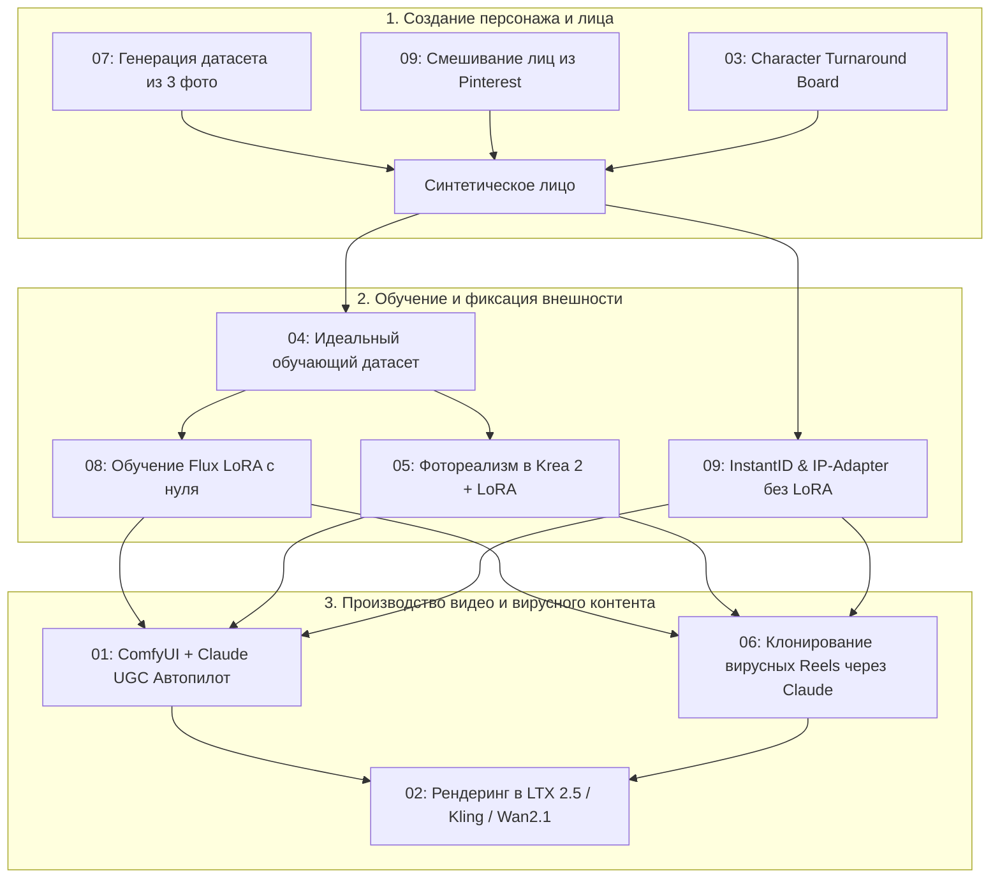

# 🎬 AI Influencer & UGC Video Workflows — База знаний и полные транскрибации

Комплексная библиотека подробных транскрибаций и архитектурных разборов серии обучающих видео от канала **Json** по созданию AI-инфлюенсеров, генерации вирусных UGC-видео, обучению LoRA моделей, формированию датасетов и автоматизации пайплайнов в ComfyUI, Claude, Krea и LTX.

---

## 📑 Навигация по видео и материалам

| # | Название видео | Категория | Длительность | Документ с транскрибацией | YouTube |
|---|---|---|---|---|---|
| **01** | **ComfyUI + Claude = Unlimited AI UGC Videos** | `UGC Video Automation` | `07:49` | [`01_comfyui_claude_unlimited_ai_ugc_videos.md`](01_comfyui_claude_unlimited_ai_ugc_videos.md) | [Смотреть](https://www.youtube.com/watch?v=U8l5w_sCkhg) |
| **02** | **LTX 2.5 AI Influencer Test: Fast, but Good Enough?** | `Model Benchmark / LTX` | `05:14` | [`02_ltx_2_5_ai_influencer_test.md`](02_ltx_2_5_ai_influencer_test.md) | [Смотреть](https://www.youtube.com/watch?v=sYoYrw_NMGY) |
| **03** | **This Character Board Makes Your AI Influencer 100% Consistent** | `Consistency / Character Board` | `04:42` | [`03_character_board_100_percent_consistent.md`](03_character_board_100_percent_consistent.md) | [Смотреть](https://www.youtube.com/watch?v=x9ETAqkAysg) |
| **04** | **The ONLY Dataset Video You Will Ever Need for AI Influencers** | `Dataset Engineering` | `08:53` | [`04_only_dataset_video_you_will_ever_need.md`](04_only_dataset_video_you_will_ever_need.md) | [Смотреть](https://www.youtube.com/watch?v=rbBNEVyQyyk) |
| **05** | **Krea 2 Makes AI Influencers TOO Realistic** | `LoRA / Photorealism` | `07:33` | [`05_krea_2_makes_ai_influencers_too_realistic.md`](05_krea_2_makes_ai_influencers_too_realistic.md) | [Смотреть](https://www.youtube.com/watch?v=7Hfn8g-httk) |
| **06** | **Copy Viral AI Reels in Seconds with This Claude Workflow** | `Reels Cloning / Claude` | `06:59` | [`06_copy_viral_ai_reels_in_seconds_claude.md`](06_copy_viral_ai_reels_in_seconds_claude.md) | [Смотреть](https://www.youtube.com/watch?v=Es-Kpx9mnMo) |
| **07** | **Build a Complete AI Character Dataset From Just 3 Photos** | `Dataset from 3 Photos` | `07:57` | [`07_build_complete_ai_character_dataset_3_photos.md`](07_build_complete_ai_character_dataset_3_photos.md) | [Смотреть](https://www.youtube.com/watch?v=nWlLlnjWC6k) |
| **08** | **Create an Ultra Realistic AI Influencer From Scratch** | `End-to-End LoRA Training` | `06:04` | [`08_create_ultra_realistic_ai_influencer_lora.md`](08_create_ultra_realistic_ai_influencer_lora.md) | [Смотреть](https://www.youtube.com/watch?v=xgVLleA0yZM) |
| **09** | **How to Create an AI Influencer from scratch Without Training a LoRA** | `InstantID / Non-LoRA` | `08:18` | [`09_ai_influencer_from_scratch_without_lora.md`](09_ai_influencer_from_scratch_without_lora.md) | [Смотреть](https://www.youtube.com/watch?v=_mN1AAzcBT4) |

---

## 🗺 Карта взаимосвязи технологий и процессов

---

## 🔍 Краткое содержание модулей

1. **[01. ComfyUI + Claude UGC Pipeline](01_comfyui_claude_unlimited_ai_ugc_videos.md)**: Автоматизированный разбор видео с помощью Claude VLM, создание промптов и генерация видеоряда с заменой персонажа в ComfyUI.
2. **[02. LTX 2.5 AI Influencer Benchmark](02_ltx_2_5_ai_influencer_test.md)**: Анализ новой модели LTX 2.5 для быстрой генерации видеоконтента с инфлюенсерами на локальных GPU.
3. **[03. Character Turnaround Board](03_character_board_100_percent_consistent.md)**: Использование анимационных модел-шитов (ракурсы, эмоции) для 100% консистентности лица и тела.
4. **[04. The Complete Dataset Blueprint](04_only_dataset_video_you_will_ever_need.md)**: Полная методология создания обучающего датасета (пропорции планов, вариативность света, JoyCaption/Florence кэпшенинг).
5. **[05. Krea 2 & Hyperrealistic LoRA](05_krea_2_makes_ai_influencers_too_realistic.md)**: Достижение реалистичной текстуры кожи, естественного шума мобильной камеры и борьба с «пластиковым» эффектом.
6. **[06. Reverse-Engineering Viral Reels](06_copy_viral_ai_reels_in_seconds_claude.md)**: Клонирование структуры, хуков и визуала трендовых рилсов за минуты с помощью кастомных Claude-скиллов.
7. **[07. 3-Photo Character Dataset](07_build_complete_ai_character_dataset_3_photos.md)**: Генерация полноценного фотосета персонажа из 3 базовых селфи через биометрический деконструкт в Claude.
8. **[08. Ultra-Realistic LoRA from Scratch](08_create_ultra_realistic_ai_influencer_lora.md)**: Пошаговый пайплайн обучения Flux/SDXL LoRA в AI-Toolkit и инференс в ComfyUI.
9. **[09. Zero-Training Influencer Workflow](09_ai_influencer_from_scratch_without_lora.md)**: Быстрый запуск инфлюенсера без обучения LoRA с использованием Pinterest референсов, InstantID и Face Detailer.
